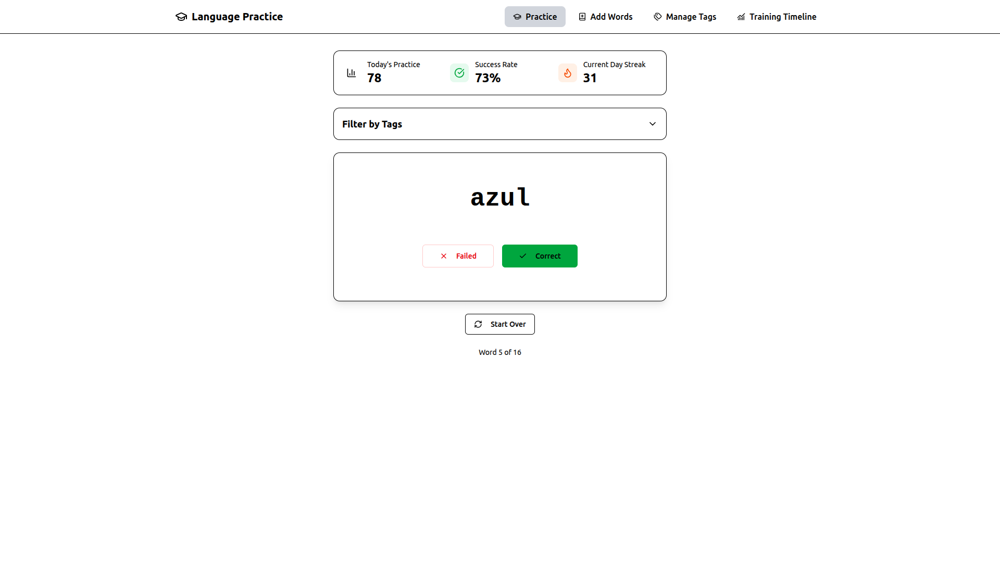
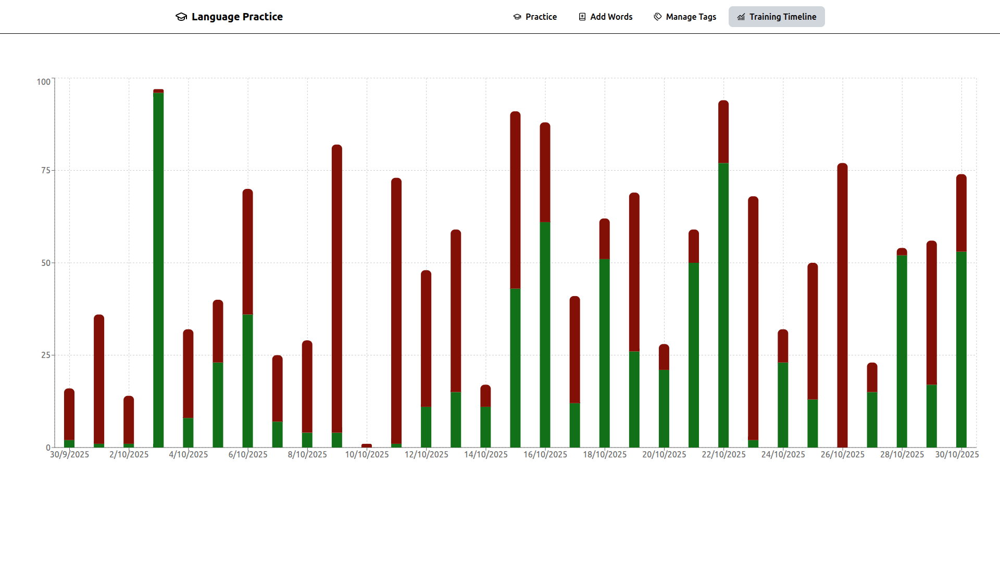

# 🗣️ Language Training

A lightweight **React + TypeScript** web app that helps you **practice vocabulary** and **track your progress** over time.
Easily organize your words by **tags**, test yourself interactively, and watch your **streak and accuracy** grow — all stored locally on your device.

---

<div style="display: flex; gap: 2%; ">
    
    
</div>

## ✨ Features

- ✅ **Word Practice** – Review and test your vocabulary in multiple languages.
- 🏷️ **Tag-Based Filtering** – Organize words by categories such as _verbs_, _food_, _travel_, etc.
- 📈 **Progress Tracking** – Track your **daily streak** and **overall accuracy score**.
- 💾 **Offline-Ready** – All your data is securely saved in **localStorage**, with no server required.
- 🧠 **Adaptive Feedback** – Identify words you struggle with and improve them over time.
- 🎨 **Clean Interface** – Built with TypeScript and React for speed, simplicity, and maintainability.

---

## 🧩 Tech Stack

| Area            | Technology               |
| --------------- | ------------------------ |
| Frontend        | React + TypeScript       |
| Styling         | Tailwind CSS             |
| State / Storage | Browser **localStorage** |
| Build Tool      | Vite                     |

---

## 🗂️ Project Structure

```
language-training/
├── src/
│   ├── components/      # Reusable UI components
│   ├── hooks/           # Custom React hooks (e.g., useStoredVar)
│   ├── lib/             # Utilities functions
│   ├── models/          # Models for the objects
│   ├── pages/           # Main application views
│   ├── utils/           # Helper functions
│   ├── App.tsx          # Root component
│   └── main.tsx         # Entry point
├── index.html
├── package.json
├── tsconfig.json
└── others...
```

---

## 💡 Future Improvements

- [ ] Add spaced repetition logic for smarter practice scheduling
- [ ] Allow import/export of word lists

---

## 🔒 Data & Privacy

This app is fully client-side.
All data (words, progress, preferences) is stored **locally** in your browser via `localStorage`.
No external servers, accounts, or APIs are required.

---

## 📜 License

This project currently has a **MIT License** — contributions and forks are welcome.

---

## 🤝 Contributing

Contributions, suggestions, and feature ideas are always welcome!
If you’d like to help improve _Language Training_, feel free to open an issue or submit a pull request.

---

### 🧭 Keywords

`language-learning` · `react`

## 📜 Development History

### v1.0.0

Just a MVP, probably still has a lot of bugs, bad UX and only basic functionalities

### v1.0.1

- Cleaner code
- Page Icon & Title
- Has a basic CI (tries to build the app)

### v1.0.2

- Has some improvements in UX (can still improve a lot)
- Tries to automate releases, but got some weird error (maybe try to do it again in the future)

### v1.1.0

- Finished UX improvements
- Remodeled stats tracking
  - Now it tracks your practices and accuracy by day
  - You can view a timeline of you activity on a designated tab
  - Keeps a streak of days (like duolingo)
